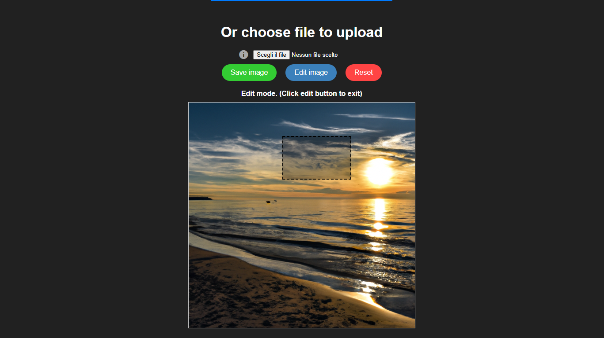

# Dall-e-image-editor

This web application enables users to generate and edit images by selecting portions of images and inputting text. Users can choose to generate images from a geenrated image or start with one of their choice, utilizing requests to the Dall-e API. After registering and logging in, users need to add an API key to their profile for generation requests. Generated images are saved in a user-specific history for easy access and reference.


### Java version 17.0.2

## Front-end Installation

### Node.js and npm Installation:

#### Download and install Node.js from https://nodejs.org (version 20.10.0)

Verify the installation of Node.js and npm by running the following commands in your terminal or command prompt:

```bash
node -v
npm -v
```

### Angular installation (version 17.0.5)

Open your terminal or command prompt.
Install Angular CLI globally by running the following command:

```bash
npm install -g @angular/cli
```

Open a terminal in the project path and install project dependencies by running:

```bash
npm install
```


To start the frontend locally:

```bash
ng serve
```

## Back-end Installation

### PostgreSQL

Download and install PostgreSQL from https://www.postgresql.org/download/

### DBeaver (for Database Management)
Download and install DBeaver from https://dbeaver.io/download/

Launch DBeaver and create a new database connection.

Use the following details (modify as your setup):
```
Host: localhost (or your database server IP)
Port: 5432 (or your PostgreSQL port)
Database: Create a new database with a name of your choice.
Username: Your PostgreSQL username.
Password: Your PostgreSQL password.
```
Test the connection and save it.

## Resources properties

To run this project, you will need to add the following file to resources folder:

`application.properties`:

```
spring.application.name=name

spring.datasource.url=jdbc:postgresql://localhost:5432/mybatabase
spring.datasource.username=db-name
spring.datasource.password=db-password
spring.jpa.hibernate.ddl-auto=update
spring.jpa.show-sql=true

spring.servlet.multipart.max-file-size=10MB
spring.servlet.multipart.max-request-size=10MB

logging.level.org.springframework.web=DEBUG
logging.level.org.springframework.security=DEBUG

```

`properties.yaml`:

```
jwt:
  secret: mysecret with HS256 algorithm
  expiration: token expiration time in milliseconds
```

Note that the database information refers to the one created on dbeaver.

## Screenshot

### Auth Page


*When the application is launched, a login screen is displayed that allows users to log in with their credentials or to register to create a new account.*

---

### Login Page


*The login page allows users to enter their credentials to access the application.*

---

### Registration Page


*New users can register by filling out the necessary information in the registration page.*

---

### Homepage


*The main screen of the Dall-e 3 Image Generator application, where users can enter text descriptions for the purpose of generating custom images, select a style, mood or upload a file. Through the buttons in the upper right corner, it is possible to log out or access settings that will allow the user to edit their apiKey.*

---

### Chat Selection


*The list on the left shows the chat history, with the ability for the user to select a previously generated image to download, make an edit or delete it.*

---

### Create Box Selection for Edit


*Once an image has been selected or obtained subsequent to a generation, it is possible to make a change by going, through the use of the mouse, to create a selection within the image and describing the modification to be made.*

---

### Generated Image with Added Bird


*A bird has been added in the selected box, demonstrating the editing feature of the application.*


## Authors

- [@Francesco-Campagna](https://github.com/Francesco-Campagna)

